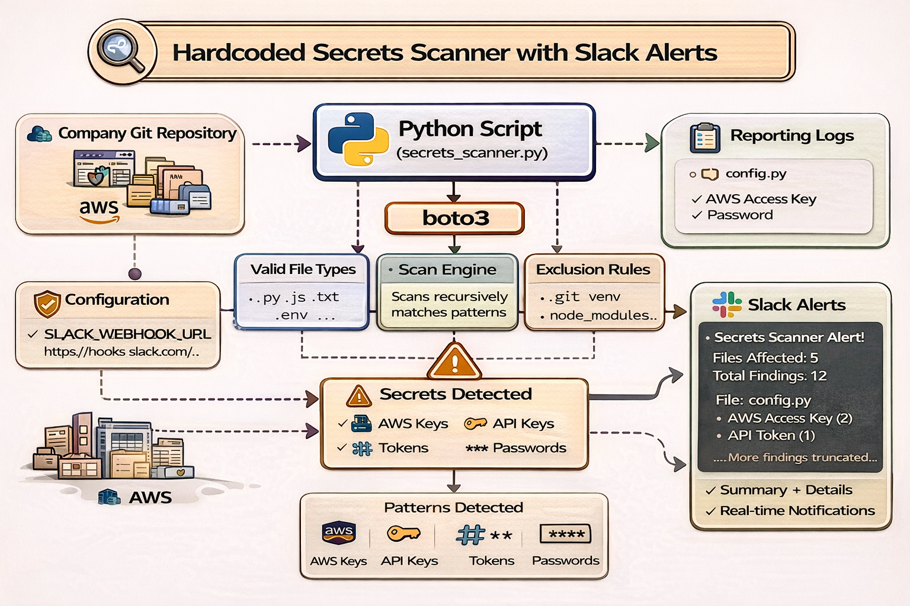

# Python-based Automated Secrets Scanner with Slack Alerting

A lightweight Python tool to detect hardcoded secrets in code repositories. The tool further flags risky patterns and sends real-time Slack alerts for real-time visibility.

The tool scans for:

- AWS keys
- API tokens
- Passwords
- Private keys

The tool empowers teams to detect and neutralize risks early, ensuring detection and visibility work hand-in-hand.

## Why This Matters

Hardcoded secrets are one of the leading causes of cloud breaches.

Examples:

- Exposed AWS keys leads to account takeover
- API tokens lead data exfiltration
- Password leaks results in unauthorized access

## Features

- Detects:

    - AWS credentials
    - API keys
    - Passwords
    - Private keys
- Recursive scanning
- Lightweight and fast
- No external dependencies

## Installation

git clone https://github.com/ericpaatey/auto-secrets_scanner-with-slack-alerting.git

cd secrets-scanner

## Usage
python secrets_scanner.py /path/to/repo

## Example Output

Potential Secrets Found:

File: app/config.py
  - AWS Access Key (1 matches)
  - Password (2 matches)
--------------------------------------------------

## Setup Slack Integration
1. Create Webhook
Go to Slack → Apps → Incoming Webhooks

Copy webhook URL

2. Export Environment Variable
export SLACK_WEBHOOK_URL=https://hooks.slack.com/services/XXXX

## Slack Alerts

## Setup
export SLACK_WEBHOOK_URL=https://hooks.slack.com/services/XXXX

Behavior

Sends summary + top findings

Truncates long outputs

Skips alerts if no issues found

## Best Practices

Never commit secrets to Git

Use:
 - AWS Secrets Manager
 - Environment variables
 - Vault solutions

## Rationale (Why I Built This)

This project addresses a critical DevSecOps gap:

Developers often unintentionally commit secrets into code repositories.

In cloud-native systems, this can lead to:

- Immediate exploitation
- Financial loss
- Security breaches

## Benefits
1. Security:
Prevent credential leaks early

2. Speed:
Fast detection before deployment

3. Automation
Can integrate into CI/CD pipelines

4. Visibility:
Highlights risky code patterns

## Use Cases (DevOps / SRE)
1. CI/CD Pipeline Gate:
Fail builds if secrets are detected

2. Pre-Commit Hook
Stop developers from committing secrets

3. Repo Audits
Scan legacy repositories

4. Security Reviews
Part of DevSecOps workflows

## Architecture

